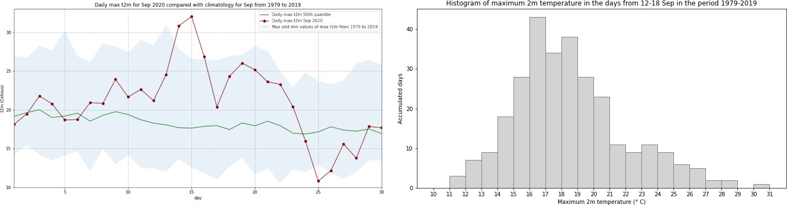

# Copernicus Climate Change Service (C3S) Data Tutorials

Discover how to access and handle data of the past, present and future climate!

This section contains Jupyter notebook based tutorials that demonstrate how to access and process the wide variety of climate data provided by the [Climate Data Store](https://cds.climate.copernicus.eu/) of the Copernicus Climate Change Service (C3S).



```{note}
No installation or coding is necessary to run these tutorials, and they can be easily adapted to suit your needs.
```

Please browse through the tutorials listed below, or make use of the search function to look for specific topics or data processing fuctions of interest.

```{tableofcontents}
```